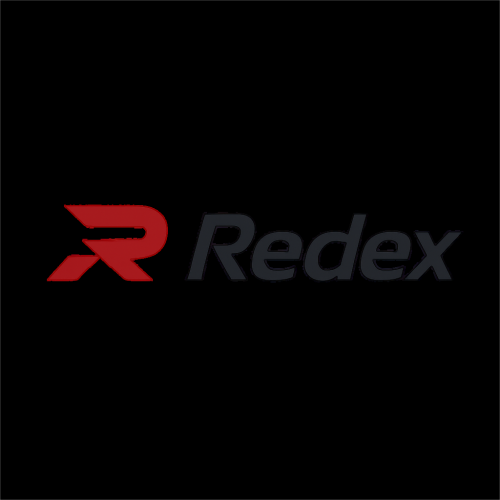
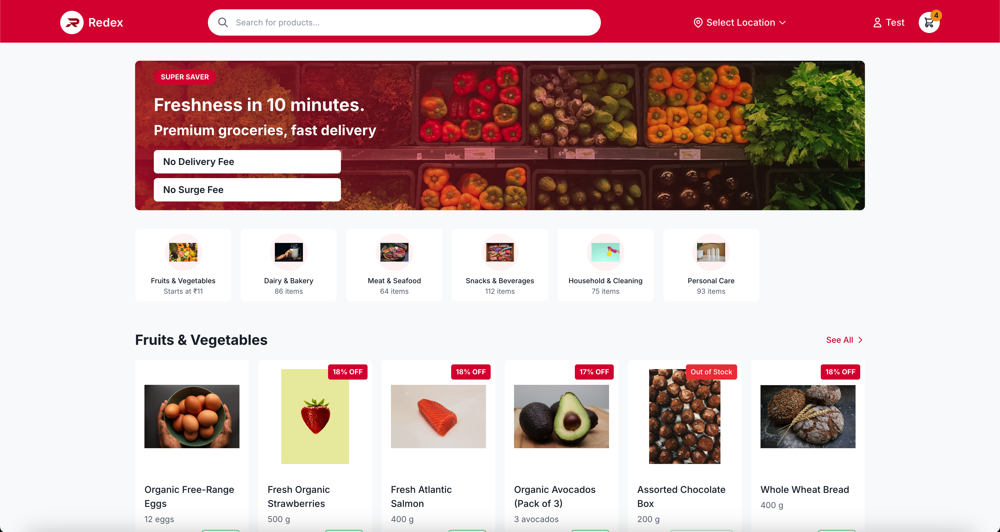
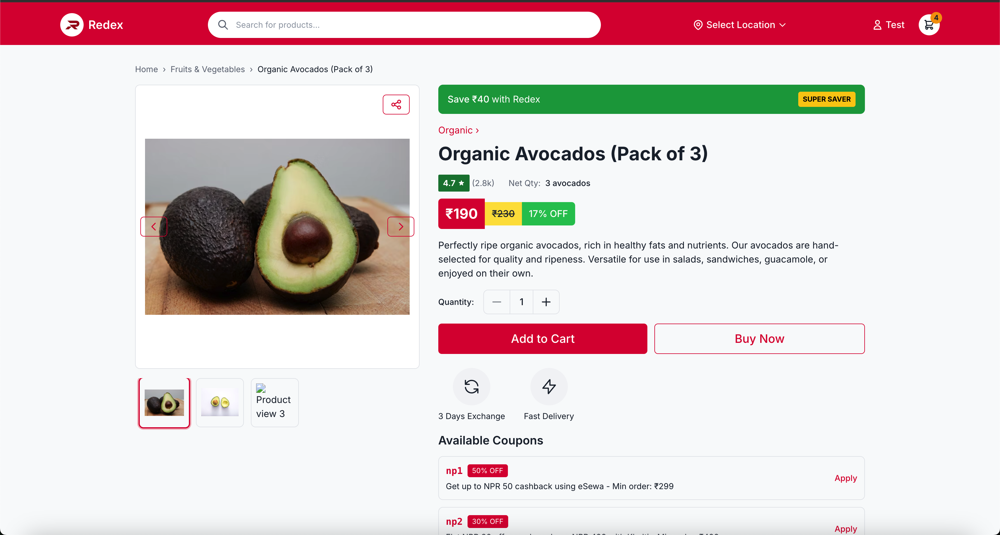

# Redex - Quick Commerce Platform

<div align="center">
  
  <h3>Delivering Essentials in Minutes</h3>
</div>

Redex is Nepal's leading quick commerce platform, delivering groceries, fresh produce, household essentials, and more to your doorstep in under 10 minutes through our network of dark stores.

## Features

### For Customers
- **⚡ Ultra-Fast Delivery**: Groceries and essentials delivered in just 10 minutes
- **🔒 Secure Authentication**: Phone number login with OTP verification and social sign-in options
- **🛒 Seamless Shopping Experience**: Intuitive product browsing with advanced search and filters
- **🔍 Detailed Product Information**: Rich product details, specifications, and user reviews
- **💲 Special Offers**: Coupons, discounts, and super saver deals
- **📱 Mobile-first Responsive Design**: Optimized experience across all devices
- **👤 Personalized Experience**: User dashboard, order history, and saved addresses
- **💳 Multiple Payment Options**: Support for various payment methods including cash on delivery
- **♿ Accessibility**: WCAG compliant with keyboard navigation and screen reader support
- **🚀 Smooth Animations**: Subtle transitions and loading states for enhanced user experience

### For Administrators
- **📊 Dashboard**: Comprehensive admin panel for store management
- **📦 Inventory Management**: Track and update product availability
- **📝 Order Processing**: View and manage customer orders
- **👥 User Management**: Customer data and access control
- **📈 Analytics**: Sales reports and customer insights
- **🗺️ Dark Store Management**: Manage multiple dark store locations

## Tech Stack

- **Frontend**: React 18, TypeScript
- **Styling**: Tailwind CSS with custom theming
- **State Management**: React Context API and hooks for component state
- **Animations**: Framer Motion for transitions and micro-interactions
- **Component Structure**: SOLID principles with reusable UI components
- **Loading States**: Component-specific skeleton loaders
- **Routing**: React Router v6 with code-splitting
- **SEO**: React Helmet Async for meta tags management
- **Performance**: Optimized bundle with lazy loading and code splitting
- **Accessibility**: WCAG 2.1 AA compliant components
- **Build Tool**: Vite for fast development and optimized production builds

## Screenshots

<div align="center">
  
  
</div>

## Getting Started

### Prerequisites

- Node.js (v16 or higher)
- npm, yarn, or bun

### Installation

1. Clone the repository:
   ```bash
   git clone https://github.com/yourusername/redex.git
   cd redex
   ```

2. Create a `.env` file in the root directory with the following variables:
   ```
   VITE_API_URL=http://localhost:8000/api
   VITE_AUTH_COOKIE_NAME=redex_auth
   ```

3. Install dependencies:
   ```bash
   npm install
   # or using yarn
   yarn install
   # or using bun
   bun install
   ```

4. Start the development server:
   ```bash
   npm run dev
   # or using yarn
   yarn dev
   # or using bun
   bun dev
   ```

5. Open your browser and navigate to `http://localhost:5173`

## Project Structure

```
src/
├── assets/           # Static assets like images
├── components/       # Reusable UI components
│   ├── auth/         # Authentication components
│   ├── layouts/      # Layout components
│   ├── navigation/   # Navigation components like Navbar, Footer
│   ├── product/      # Product-related components
│   ├── seo/          # SEO and meta tag components
│   └── ui/           # Base UI components
│       ├── accessibility/ # Accessibility components
│       ├── Card/     # Card components
│       ├── Button/   # Button components
│       ├── Skeleton/ # Skeleton loaders for various UI patterns
│       └── ...       # Other UI components
├── config/           # Configuration files including theme
├── constants/        # Constant values used throughout the app
├── data/             # Mock data for development
├── hooks/            # Custom React hooks
├── models/           # Business logic models
├── pages/            # Page components
│   ├── AboutPage/    # About page components
│   ├── CartPage/     # Cart page components
│   ├── CategoryPage/ # Category page components
│   └── ...           # Other page components
├── routes/           # Routing configuration
├── types/            # TypeScript type definitions
└── utils/            # Utility functions including animations
```

## Code Style and Conventions

- **SOLID Principles**: Single responsibility, Open-closed, Liskov substitution, Interface segregation, Dependency inversion
- **Styling**: Uses Tailwind CSS with custom theme variables, avoiding hardcoded colors
- **Components**: Focus on reusability, composability, and proper separation of concerns
- **TypeScript**: Strong typing for improved developer experience and code quality
- **Animations**: Subtle animations with Framer Motion using consistent motion patterns
- **State Management**: React hooks for component state, Context API for shared state
- **Loading States**: Component-specific skeleton loaders for improved user experience

## Component Design System

The UI component system follows these principles:

1. **Consistency**: Common design patterns and behaviors across components
2. **Accessibility**: All components meet WCAG 2.1 AA standards
3. **Theming**: Theme-based styling using Tailwind with theme variables
4. **Loading States**: Each component has a corresponding skeleton loader
5. **Animation**: Subtle motion with consistent timing and easing
6. **Responsiveness**: Fully responsive from mobile to desktop

## Available Scripts

- `npm run dev` - Start the development server
- `npm run build` - Build the app for production
- `npm run preview` - Preview the production build locally
- `npm run lint` - Run ESLint to check code quality
- `npm run test` - Run unit tests
- `npm run test:e2e` - Run end-to-end tests

## Performance Optimization

- **Code Splitting**: Each page is lazy-loaded to reduce initial bundle size
- **Progressive Loading**: Skeleton loaders for component-specific loading states
- **Image Optimization**: Responsive images with proper sizing and formats
- **Animation Performance**: GPU-accelerated animations with Framer Motion
- **Bundle Size Management**: Regular auditing of dependencies and bundle size

## SEO Strategy

- **Meta Tags**: Dynamic meta tags with React Helmet Async
- **Structured Data**: JSON-LD for rich search results
- **Sitemap**: Automatic sitemap generation (sitemap.xml)
- **Robots.txt**: Proper crawler instructions
- **Semantic HTML**: Proper heading hierarchy and semantic elements

## Accessibility

- **Keyboard Navigation**: All interactive elements are keyboard accessible
- **Screen Reader Support**: ARIA attributes and semantic HTML
- **Focus Management**: Visible focus indicators and proper focus trapping
- **Skip Links**: Allow keyboard users to skip to main content
- **Color Contrast**: All text meets WCAG AA contrast requirements
- **Responsive Design**: Properly accessible on all screen sizes

## Deployment

### Production Build

1. Create a production build:
   ```bash
   npm run build
   ```

2. The build output will be in the `dist` directory, which can be deployed to any static hosting service.

### Recommended Hosting

- [Vercel](https://vercel.com/) - Zero configuration deployment
- [Netlify](https://www.netlify.com/) - Easy continuous deployment
- [Firebase Hosting](https://firebase.google.com/docs/hosting) - Fast and secure hosting

## Contributing

We welcome contributions to Redex! Please follow these steps:

1. Fork the repository
2. Create a new branch for your feature: `git checkout -b feature/amazing-feature`
3. Make your changes and commit them: `git commit -m 'Add some amazing feature'`
4. Push to the branch: `git push origin feature/amazing-feature`
5. Open a pull request

Please make sure your code follows our coding standards and includes appropriate tests.

## License

This project is licensed under the MIT License - see the LICENSE file for details.

## Contact

For any inquiries, please contact us at support@redex.com.np

## Acknowledgements

- [React](https://reactjs.org/)
- [Tailwind CSS](https://tailwindcss.com/)
- [Framer Motion](https://www.framer.com/motion/)
- [React Router](https://reactrouter.com/)
- [React Helmet Async](https://github.com/staylor/react-helmet-async)
- [Vite](https://vitejs.dev/)
- All our contributors and users
